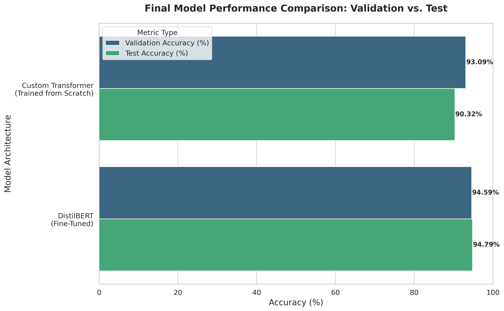
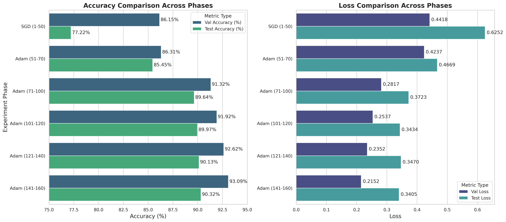
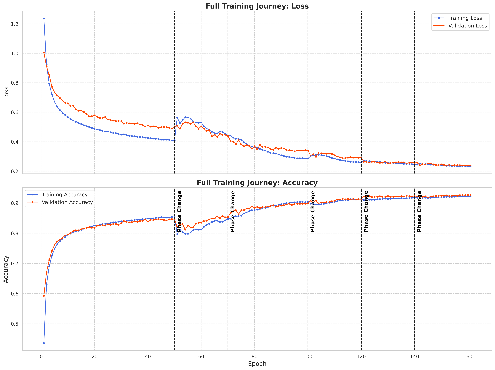

# **End-to-End Transformer for Text Classification: From Scratch vs. Fine-Tuning**


> Advanced NLP: Custom Transformer vs. DistilBERT Fine-Tuning

### ► Try the Live Demo!
### [Live Interactive Demo on Hugging Face Spaces](https://huggingface.co/spaces/nabeelshan/distilbert-agnews-classifier) | [Fine-Tuned Model on Hugging Face](https://huggingface.co/nabeelshan/distilbert-finetuned-agnews)

An end-to-end project building a **Transformer from scratch** and fine-tuning **DistilBERT** for text classification, achieving **94.8% test accuracy** and deployed as a live, interactive demo on **Hugging Face Spaces**.

---

## Table of Contents
1. [Project Overview](#-project-overview)
2. [Key Features](#-key-features)
3. [Technical Deep Dive](#-technical-deep-dive)
3. [Final Results & Analysis](#-final-results--analysis)
4. [Tech Stack](#tech-stack)
5. [Repository Structure](#repository-structure)
6. [Setup & Usage](#setup--usage)

---


## 🚀 Project Overview

This project presents a comprehensive, end-to-end investigation into Transformer-based text classification on the **AG News dataset**. The work covers the full MLOps lifecycle—from data engineering and model architecture design to multi-stage training, comparative analysis, and final deployment.

The exploration was conducted in two primary phases:

1.  **Build from Scratch**: A custom Transformer Encoder was implemented in PyTorch to establish a deep, foundational understanding of the architecture, including custom positional encodings and multi-head self-attention. This model was trained for over **160 epochs** using a meticulously documented, multi-stage optimization strategy, achieving a final test accuracy of **90.32%**.

2.  **Fine-Tune a Pre-Trained Model**: A state-of-the-art DistilBERT model was fine-tuned using the Hugging Face ecosystem to leverage the power of transfer learning. This approach achieved a superior test accuracy of **94.79%** in just 3 epochs.

The project culminates in a head-to-head comparison of the two approaches and a live, interactive web application deployed on Hugging Face Spaces, demonstrating a robust ability to both build and deploy advanced NLP solutions.

---

## ✨ Key Features

* **Custom Transformer Implementation**: A complete, from-scratch implementation of a `TransformerEncoder`-based classifier in PyTorch, including a custom `PositionalEncoding` layer to build foundational knowledge.

* **Advanced Training Strategy**: A systematic, multi-phase training regimen spanning **160 epochs**, showcasing techniques like checkpointing, optimizer switching (SGD vs. Adam), and dynamic learning rate scheduling (`StepLR`, `CosineAnnealingLR`).

* **State-of-the-Art Fine-Tuning**: Leveraged transfer learning by fine-tuning a pre-trained **DistilBERT** model using the Hugging Face ecosystem, achieving a **94.79% test accuracy** in just 3 epochs.

* **Efficient Data Handling**: An optimized data loading pipeline that sorts input sequences by length to minimize padding, significantly accelerating training throughput.

* **In-Depth Comparative Analysis**: A direct, quantitative comparison between the from-scratch and fine-tuned models, supported by rich visualizations of learning curves and performance metrics using Matplotlib and Seaborn.

* **Interactive Web Demo**: A user-friendly Gradio application deployed on **Hugging Face Spaces** for live, interactive inference, making the final model's capabilities tangible and accessible.

---

## 🔧 Technical Deep Dive

### 1. Custom Transformer Architecture

The core of the from-scratch model is a `ClassificationNet` module built with PyTorch's `nn.TransformerEncoder`.

* **Embedding Layer**: Converts input token indices into dense vectors of `embedding_dim`.
* **Positional Encoding**: Injects positional information into the embeddings, which is crucial since the self-attention mechanism is permutation-invariant. This is implemented using sine and cosine functions of different frequencies.
    ```python
    # src/model.py: PositionalEncoding
    class PositionalEncoding(nn.Module):
        def __init__(self, d_model, vocab_size=5000, dropout=0.1):
            super().__init__()
            self.dropout = nn.Dropout(p=dropout)
    
            pe = torch.zeros(vocab_size, d_model)
            position = torch.arange(0, vocab_size, dtype=torch.float).unsqueeze(1)
            div_term = torch.exp(
                torch.arange(0, d_model, 2).float()
                * (-math.log(10000.0) / d_model)
            )
            pe[:, 0::2] = torch.sin(position * div_term)
            pe[:, 1::2] = torch.cos(position * div_term)
            pe = pe.unsqueeze(0)
            self.register_buffer("pe", pe)
    
        def forward(self, x):
            x = x + self.pe[:, :x.size(1), :]
            return self.dropout(x)
    ```
* **Transformer Encoder**: A stack of `nn.TransformerEncoderLayer` modules processes the sequence. Each layer consists of a multi-head self-attention mechanism and a feed-forward network.
* **Classifier Head**: A final linear layer maps the mean of the Transformer's output sequence to the number of classes.

### 2. Data Processing Pipeline

The `dataloader.py` script handles the efficient preparation of the AG News dataset.

* **Tokenization & Vocabulary**: Uses `torchtext` to tokenize text and build a vocabulary from the training data.
* **Length-Based Sorting**: The `NewsDataset` class sorts the training data by text length. This is a key optimization that groups similarly-sized sentences into batches, drastically reducing the amount of `<pad>` tokens needed and improving GPU utilization.
* **Custom `collate_batch` Function**: Pads sequences within each batch to the maximum length in that batch and prepares tensors for the model.
    ```python
    # src/dataloader.py: collate_batch function
    def collate_batch(batch):
        label_list, text_list, len_list = [], [], []
        for (_label, _text) in batch:
            label_list.append(label_pipeline(_label))
            processed_text = torch.tensor(text_pipeline(_text), dtype=torch.int64)
            text_list.append(processed_text)
        
        labels = torch.tensor(label_list, dtype=torch.int64)
        texts = pad_sequence(text_list, batch_first=True) # Pad to max length in the batch
        return labels.to(DEVICE), texts.to(DEVICE)
    ```

---


## 📊 Final Results & Analysis

The two primary models were evaluated on the same held-out test set. The fine-tuned DistilBERT model demonstrated a significant performance improvement over the custom model trained from scratch, highlighting the immense power of transfer learning.

| Model Architecture | Best Validation Accuracy | Final Test Accuracy |
| :--- | :---: | :---: |
| Custom Transformer (From Scratch) | 93.09% | 90.32% |
| **Fine-Tuned DistilBERT** | **94.59%** | **94.79%** |

### Performance Visualization



The final comparison shows a **+4.47% absolute improvement in test accuracy** from using a fine-tuned model. This is because the pre-trained model has already learned a deep, nuanced understanding of the English language from a massive corpus, which it can then adapt to our specific task with minimal training.



The bar plots for the custom model show a clear story of iterative improvement



The learning curves for the custom model show a clear story of iterative improvement: an initial learning phase, followed by aggressive fine-tuning with Adam, and finally a "polishing" phase with `CosineAnnealingLR` to achieve the best possible performance.

---

## Tech Stack

- **Frameworks & Libraries:** PyTorch, Hugging Face (Transformers, Tokenizers, Hub), Gradio, Scikit-learn
- **Data Science & MLOps:** Pandas, NumPy, Matplotlib, Seaborn
- **Tools:** Git & GitHub, Jupyter Notebooks

---

## Repository Structure

The repository is organized to professional standards for clarity, reproducibility, and scalability, clearly separating source code, experimental notebooks, data, and outputs.

```
.
├── 📁 data/                  # Raw AG News dataset files
│   └── 📁 ag_news/
│       ├── test.parquet
│       └── train.parquet
│
├── 📁 notebooks/              # Jupyter notebooks for experimentation and analysis
│   ├── 01_Custom_Transformer_Initial_Training.ipynb
│   ├── 02_Custom_Transformer_Phase_A.ipynb
│   ├── ... (Sequential training phases)
│   ├── 08_Fine_Tuning_DistilBERT.ipynb
│   └── 09_Results_Analysis_and_Visualization.ipynb
│
├── 📁 outputs/                # All generated artifacts from the notebooks
│   ├── final_evaluation_summary.csv
│   ├── learning_curves.png
│   └── final_model_comparison_detailed.png
│
├── 📁 src/                    # Core, reusable Python source code
│   ├── dataloader.py         # Data loading and preprocessing pipeline
│   └── model.py              # Custom Transformer architecture and training functions
│
├── 📄 README.md               # You are here!
└── 📄 requirements.txt        # Python dependencies for setting up the environment
```

---

## Setup & Usage

To replicate this project, follow these steps:

### Prerequisites
- Python 3.10+
- PyTorch 2.0+
- **GPU Access (Recommended):** All training and fine-tuning scripts are configured to automatically use a CUDA-enabled GPU if available. While not strictly required, using a GPU is highly recommended to replicate the training times presented in this project.

### 1. Clone the Repository
```bash
git clone https://github.com/nabeelshan78/Transformer-AGNews-Classifier.git
cd Transformer-AGNews-Classifier
```

### 2. Set Up the Environment
Create a virtual environment and install the required packages.
```bash
python -m venv venv
source venv/bin/activate  # On Windows, use `venv\Scripts\activate`
pip install -r requirements.txt

```

### 3. Download the Dataset
The AG News dataset can be downloaded and placed in the `data/ag_news` directory.

### 4. Run the Notebooks
The notebooks are located in the `/notebooks` directory and are numbered to show the complete, iterative development process.

- **`01_...`**: The initial training and development of the custom Transformer model from scratch (Epochs 1-50).
- **`02_` to `06_...`**: A series of notebooks representing the sequential fine-tuning phases of the custom Transformer (Epochs 51-160).
- **`07_...`**: A notebook for running sample predictions with the final custom model.
- **`08_...`**: The complete fine-tuning pipeline for the state-of-the-art DistilBERT model.
- **`09_...`**: The final script that loads all experimental results and generates the comparison plots.
---
